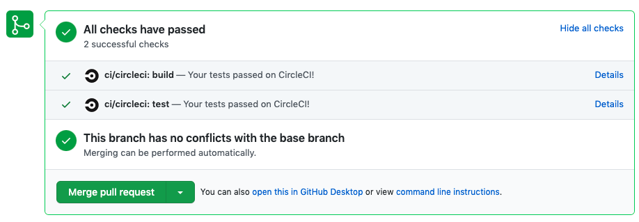

# What's this?

Github の PR ページ上で、次のように CI の詳細を表示することがあります。



このとき、`Details` のリンクがデフォルトだと同じページで開くが、大抵の場合で新しいタブで開きたい気がします（個人の感想）。
この Chrome 拡張を導入すれば、デフォルトで新しいタブが開くようになります。

# How to use

Chrome のストアからか、これをクローンしても使えます。

## クローンする場合

1:d

```
$ git clone git@github.com:aqla114/github-open-ci-in-new-tab-extension.git
$ yarn install && yarn build
```

2: Chrome を開いて、右上のところからその他のツール＞拡張機能を開く。

3: 右上のトグルでデベロッパーモードをオンにして、「パッケージされていない拡張機能を読み込む」をクリック。

4: クローンしたルートフォルダを選択すると動くはず。
